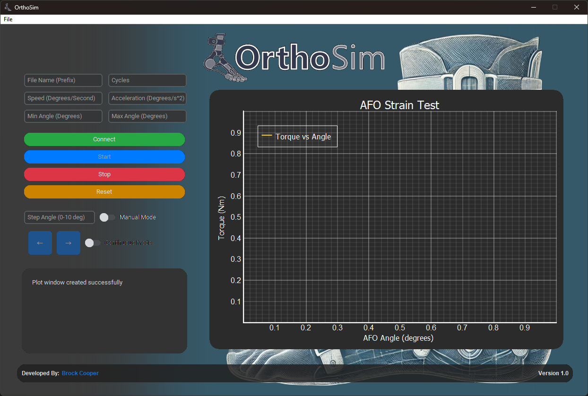

# Ortho-Sim 🦶

Ortho-Sim is a graphical user interface (GUI) written in python designed for displaying and logging the live Angle Vs Torque of an ankle foot orthosis (AFO). Uses an Odrive motor controller [Odrive S1](https://shop.odriverobotics.com/products/odrive-s1) with a [PhidgetBridge 4-Input](https://www.phidgets.com/?prodid=1027) device.   

The interface outputs the readings at a 125Hz interval. The data is logged to a CSV file within a folder called '_OrthoSim Logs_' located in the `Ortho-Sim.exe` root directory. This folder will be created on the first time the program logs any data.

An AFO is a support device intended to control the position and motion of the ankle, compensate for weakness, or correct deformities. The program was designed for a study into 3D printed AFO's testing different material properties and printing ortietnations whilst being able to test the stiffness and strain for each prototype. 

# Physical Mechanical Tester

# Graphical User Interface (GUI)

There is an `auto_exe_builder.py` file that allows you to compile and build the executable to run on machines that don't have python installed. This uses the pyinstaller python library.

## Load Cell Interface
For developement the PhidgetBridge drivers below need to be installed for your system, select the appropriate one for your system. 
- [⬇ 32-bit Phidget22 Driver Download](https://www.phidgets.com/downloads/phidget22/libraries/windows/Phidget22-x86.exe)
- [⬇ 64-bit Phidget22 Driver Download](https://www.phidgets.com/downloads/phidget22/libraries/windows/Phidget22-x64.exe)

# Design Changelog
## Parts
 - Motor - [Dual Shaft Motor - D6374 150 Kv](https://wwshop.odriverobotics.com/collections/motors/products/odrive-custom-motor-d6374-150kv)
 - Motor Controller - [ODrive S1](https://wwshop.odriverobotics.com/collections/motor-controllers/products/odrive-s10)
 - Gearbox - [EG Series Planetary Gearbox Gear Ratio 50:1 Backlash 20arc-min for Nema 34 Stepper Motor](https://www.omc-stepperonline.com/au-on-sale-eg-series-planetary-gearbox-gear-ratio-50-1-backlash-20arc-min-for-nema-34-stepper-motor-au-eg34-g50)
 - Load Cell - [DACell UU-K50 (D2311047)](https://appliedmeasurement.com.au/product/ama-xtran-load-cells/)

## Mechanical Changes
 - Drilled new hole in Motor Swing arm inline with AFO upright. 
 - New pin for motor swing arm reduce backlash
 - Shorted connecting rod bewteen Motor Swing arm and AFO upright.
 - Made gearbox mounting plate to adapt new [EG Series Planetary Gearbox Gear Ratio 50:1 Backlash 20arc-min for Nema 34 Stepper Motor](https://www.omc-stepperonline.com/au-on-sale-eg-series-planetary-gearbox-gear-ratio-50-1-backlash-20arc-min-for-nema-34-stepper-motor-au-eg34-g50)
 
## Electrical Changes
 - New Motor with BLDC motor controller
 - E-Stop with magnetic reed swtich that pulls nRST low to reset the motor controller.
    
    __NOTE: Door needs to be shut in order to connect to the motor controller__

# requirements.txt

- aiohappyeyeballs==2.4.0
- aiohttp==3.10.5
- aiosignal==1.3.1
- altgraph==0.17.4
- appdirs==1.4.4
- asttokens==2.4.1
- async-timeout==4.0.3
- attrs==24.2.0
- colorama==0.4.6
- contourpy==1.3.0
- CTkMessagebox==2.7
- customtkinter==5.2.2
- cycler==0.12.1
- darkdetect==0.8.0
- decorator==5.1.1
- et-xmlfile==1.1.0
- exceptiongroup==1.2.2
- executing==2.1.0
- fonttools==4.53.1
- frozenlist==1.4.1
- future==1.0.0
- idna==3.10
- iniconfig==2.1.0
- ipython==8.27.0
- iso8601==2.1.0
- jedi==0.19.1
- kiwisolver==1.4.7
- matplotlib==3.9.2
- matplotlib-inline==0.1.7
- multidict==6.1.0
- numpy==1.23.0
- odrive==0.6.8
- openpyxl==3.1.5
- packaging==24.1
- parso==0.8.4
- pefile==2024.8.26
- Phidget22==1.20.20240911
- pillow==10.4.0
- pluggy==1.5.0
- prompt_toolkit==3.0.47
- pure_eval==0.2.3
- pyelftools==0.31
- Pygments==2.18.0
- pyinstaller==5.13.2
- pyinstaller-hooks-contrib==2024.10
- PyOpenGL==3.1.9
- pyparsing==3.1.4
- PyQt5==5.15.11
- PyQt5-Qt5==5.15.2
- PyQt5_sip==12.17.0
- pyqtgraph==0.13.7
- pyserial==3.5
- pytest==8.3.5
- python-dateutil==2.9.0.post0
- pyusb==1.2.1
- pywin32==306
- pywin32-ctypes==0.2.3
- pywinstyles==1.8
- PyYAML==6.0.2
- serial==0.0.97
- six==1.16.0
- stack-data==0.6.3
- tomli==2.2.1
- traitlets==5.14.3
- typing_extensions==4.12.2
- wcwidth==0.2.13
- yarl==1.11.1